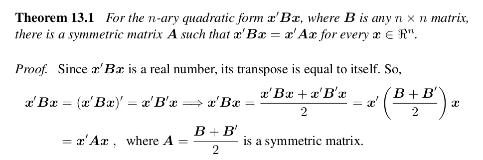

```{r setup, include=FALSE}
knitr::opts_chunk$set(echo = FALSE)
```


## Matriz de Fisher na entrada $i=1,j=2$

\begin{equation}
\begin{aligned}
\dot{l}_1(\boldsymbol{\theta})\dot{l}_2(\boldsymbol{\theta}) =
\frac{1}{4}
\Bigg\{
\Bigg[
tr(\boldsymbol{\Sigma}^{-1}\frac{\partial \boldsymbol{\Sigma}}{\theta_1}) -
\textbf{z}^{T}(\boldsymbol{\Sigma}^{-1} \frac{\partial \boldsymbol{\Sigma}}{\theta_1}\boldsymbol{\Sigma}^{-1})\textbf{z}
\Bigg]* \\
\Bigg[
tr(\boldsymbol{\Sigma}^{-1}\frac{\partial \boldsymbol{\Sigma}}{\theta_2}) -
\textbf{z}^{T}(\boldsymbol{\Sigma}^{-1} \frac{\partial \boldsymbol{\Sigma}}{\theta_2}\boldsymbol{\Sigma}^{-1})\textbf{z}
\Bigg]
\Bigg\}
\end{aligned}
\end{equation}

## Esperança da forma quadrática

Como $\boldsymbol{\mu} = \mathbf{0}$, então $E[\mathbf{z}^TA\mathbf{z}] = tr(A\boldsymbol{\Sigma})$. Portanto

\begin{equation}
\begin{aligned}
&E\Bigg\{
tr(\boldsymbol{\Sigma}^{-1}\frac{\partial \boldsymbol{\Sigma}}{\theta_1})
\mathbf{z}^{T}
\Bigg[
\boldsymbol{\Sigma}^{-1} \frac{\partial\boldsymbol{\Sigma}}{\theta_2}\boldsymbol{\Sigma}^{-1}
\Bigg]
\mathbf{z}
\Bigg\} \\
&=
tr(\boldsymbol{\Sigma}^{-1}\frac{\partial \boldsymbol{\Sigma}}{\theta_1})
tr\Bigg[
\boldsymbol{\Sigma}^{-1}\frac{\partial \boldsymbol{\Sigma}}{\theta_2}\boldsymbol{\Sigma}^{-1}\boldsymbol{\Sigma}
\Bigg] \\
&=
tr(\boldsymbol{\Sigma}^{-1}\frac{\partial \boldsymbol{\Sigma}}{\theta_1})
tr\Bigg[
\boldsymbol{\Sigma}^{-1}\frac{\partial \boldsymbol{\Sigma}}{\theta_2}
\Bigg]
\end{aligned}
\end{equation}

## Covariância entre Formas Quadráticas

Queremos calcular

\begin{equation}
\begin{aligned}
&E\Bigg\{
\Bigg[
\textbf{z}^{T}(\boldsymbol{\Sigma}^{-1} \frac{\partial \boldsymbol{\Sigma}}{\theta_1}\boldsymbol{\Sigma}^{-1})\textbf{z}
\Bigg]
\Bigg[
\textbf{z}^{T}(\boldsymbol{\Sigma}^{-1} \frac{\partial \boldsymbol{\Sigma}}{\theta_2}\boldsymbol{\Sigma}^{-1})\textbf{z}
\Bigg]
\Bigg\} \\
&=
Cov\Bigg(
\textbf{z}^{T}(\boldsymbol{\Sigma}^{-1} \frac{\partial \boldsymbol{\Sigma}}{\theta_1}\boldsymbol{\Sigma}^{-1})\textbf{z},
\textbf{z}^{T}(\boldsymbol{\Sigma}^{-1} \frac{\partial \boldsymbol{\Sigma}}{\theta_2}\boldsymbol{\Sigma}^{-1})\textbf{z}
\Bigg)
\end{aligned}
\end{equation}

## Covariância entre Formas Quadráticas

O resultado [daqui](https://en.wikipedia.org/wiki/Quadratic_form_(statistics)) é para covariâncias simétricas, enquanto que o resultado do Seber & Lee (página 45) é para covariâncias na forma $kI_n$. Minha tentativa foi conferir se $\boldsymbol{\Sigma}^{-1}\frac{\partial \boldsymbol{\Sigma}}{\theta_1}\boldsymbol{\Sigma}^{-1}$ é simétrica.

## Covariância entre Formas Quadráticas - Simetria

\begin{equation}
\begin{pmatrix}
  C_{11}^{*}( \textbf{h} ) & C_{12}^{*}( \textbf{h} ) \\
  C_{21}^{*}( \textbf{h} ) & C_{22}^{*}( \textbf{h} )
\end{pmatrix}
\begin{pmatrix}
  M(\textbf{h} | \nu_1,a) & \\
  \frac{\rho \sigma_2}{2 \sigma_1} M(\textbf{h} | \frac{\nu_1 + \nu_2}{2},a) & \textbf{\huge o }
\end{pmatrix}
\begin{pmatrix}
  C_{11}^{*}( \textbf{h} ) & C_{12}^{*}( \textbf{h} ) \\
  C_{21}^{*}( \textbf{h} ) & C_{22}^{*}( \textbf{h} )
\end{pmatrix}
\end{equation}

## Covariância entre Formas Quadráticas - Simetria

>- Tenho que se é simétrica para $\sigma^2_1$ e provavelmente para o resto também
>- Argumento a favor: $\frac{\partial \boldsymbol{\Sigma}}{\partial \sigma^2_1}$ é simétrica, assim como $\Sigma^{-1}$, então $\Sigma^{-1}\frac{\partial \boldsymbol{\Sigma}}{\partial \sigma^2_1}\Sigma^{-1}$ é simétrica.
>- Segundo argumento a favor: contas


## Covariância entre Formas Quadráticas - Simetria


\begin{equation}
\begin{pmatrix}
  C_{11}^{*}( \textbf{h} )M(\textbf{h} | \nu_1,a) + C_{12}^{*}( \textbf{h} )\frac{\rho \sigma_2}{2 \sigma_1} M(\textbf{h} | \nu_3,a) &
  C_{11}^{*}( \textbf{h} )\frac{\rho \sigma_2}{2 \sigma_1} M(\textbf{h} | \nu_3,a)\\
  C_{21}^{*}( \textbf{h} )M(\textbf{h} | \nu_1,a) + C_{22}^{*}( \textbf{h} )\frac{\rho \sigma_2}{2 \sigma_1} M(\textbf{h} | \nu_3,a) &
  C_{21}^{*}( \textbf{h} )\frac{\rho \sigma_2}{2 \sigma_1} M(\textbf{h} | \nu_3,a) \\
\end{pmatrix} *
\end{equation}
\begin{equation*}
\begin{pmatrix}
  C_{11}^{*}( \textbf{h} ) & C_{12}^{*}( \textbf{h} ) \\
  C_{21}^{*}( \textbf{h} ) & C_{22}^{*}( \textbf{h} )
\end{pmatrix}
\end{equation*}


## Covariância entre Formas Quadráticas - Simetria

\begin{equation}
A = \Sigma^{-1}\frac{\partial \boldsymbol{\Sigma}}{\partial \sigma^2_1}\Sigma^{-1} = \begin{pmatrix}
A_{11} & A_{12} \\
A_{21} & A_{2}
\end{pmatrix}
\end{equation}


\begin{equation}
\begin{aligned}
&A_{12} = C^{\star}_{11}M(h|a,v_1)C^{\star}_{12} + 
kC^{\star}_{12}M(h|a,v_1)C^{\star}_{12} +  \\ &kC^{\star}_{11}M(h|a,v_1)C^{\star}_{22} 
\\
\\
&A_{21} = C^{\star}_{21}M(h|a,v_1)C^{\star}_{11} + 
kC^{\star}_{22}M(h|a,v_1)C^{\star}_{11} + \\ &kC^{\star}_{21}M(h|a,v_1)C^{\star}_{21} 
\end{aligned}
\end{equation}


## Simetrização

>- Banerjee página (403/422), th. 13.1
 
 
## Caveat

>- Só depois de procurar no livro do banerjee eu descobri que o resultava no wikipedia. 
